# 👾Retro-Gaming e o seu impacto

Repositorio criado para dar host ao projeto desenvolvido para a disciplina de Tecnologias de Internet na Universidade da Maia. Desenvolvido pelo grupo inf25tig02 [@DanielNunesPT](https://github.com/DanielNunesPT)

# 🕹️Descrição do Projeto

Este projeto foi desenvolvido no âmbito da disciplina de Tecnologias da Internet e consiste num website focado na preservação e celebração do fenómeno do retro-gaming. O foco central recai sobre três das consolas que mais marcaram a evolução do entretenimento multimédia interativo: a PlayStation (PS1), a PlayStation 2 (PS2) e o Game Boy Color (GBC).

A arquitetura do website evoluiu para um ecossistema de 5 páginas estáticas e interativas:

    🏠 Página Principal (index.html): Introduz o conceito do projeto e apresenta uma tabela dinâmica de clássicos, populada através da leitura de um ficheiro de dados .xml.

    🕹️ Páginas das Consolas (ps1.html, ps2.html, gbc.html): Detalham as especificações técnicas de hardware, capacidades gráficas e sonoras, suportadas por multimédia integrada (áudio e vídeo).

    📝 Página de Feedback (formulario.html): Uma interface dedicada à interação com o utilizador.

# 💻Tecnologias utilizadas

[XML](https://www.w3schools.com/xml/)

[HTML5](https://www.w3schools.com/html/) 

[CSS3](https://www.w3schools.com/css/)

[Javascript](https://www.w3schools.com/js/)

# 🗂️Organização do repositório

### Imagens
Todas as imagens usadas no projeto estão guardadas neste folder

### música 

As soundtracks individuais usadas nas 4 páginas
### videos

Página onde descreve a história, alguns componentes e um dos jogos mais marcantes da consola
### styles

Todos os estilos css usados para todas as páginas
### XML

pasta com o ficheiro xml disponivel para download
### schema

Schema do projeto

### script

Ficheiro javascript do projeto

# Apresentação do projeto

#### Home Page: Index
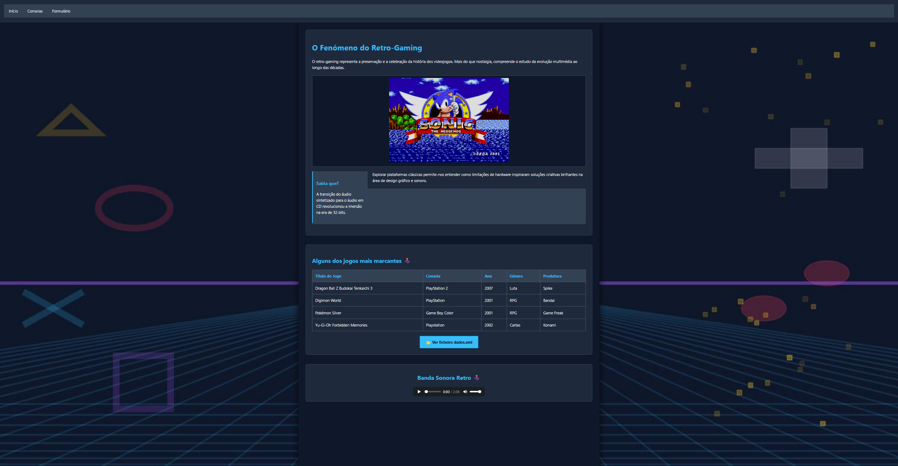
#### Página PS1: 
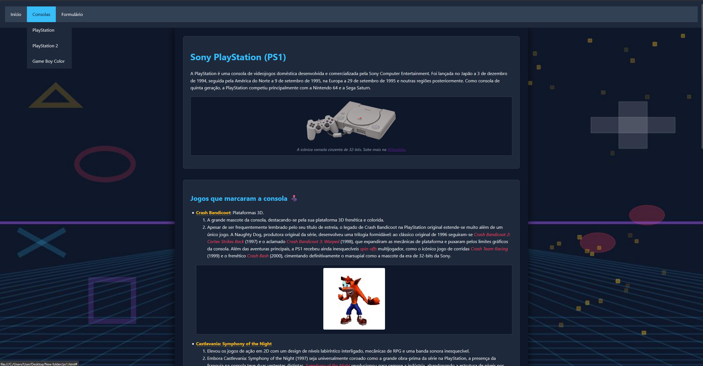
#### Página PS2:
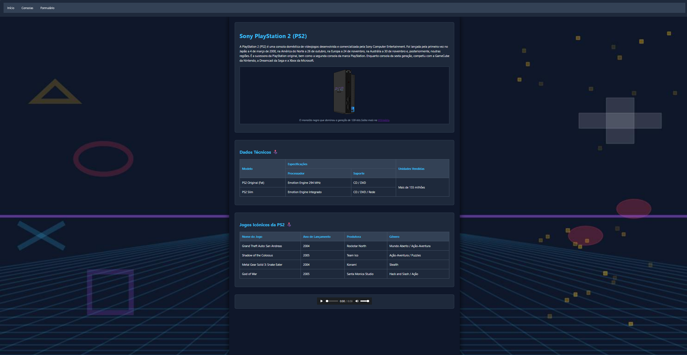
#### Página GBC:
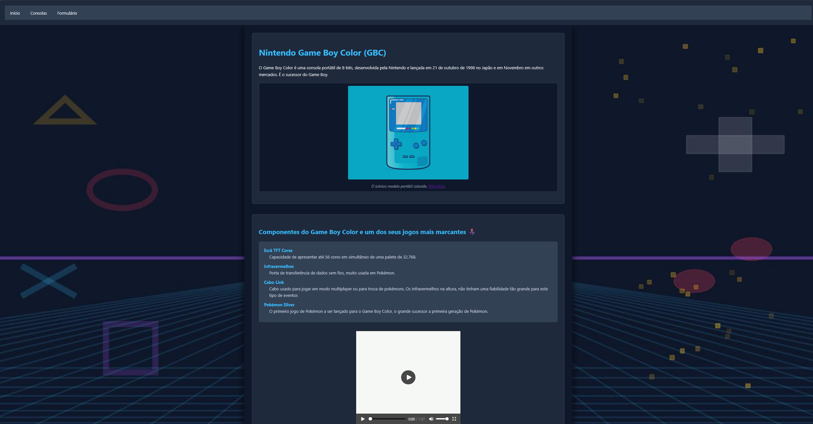
#### Página Formulário:
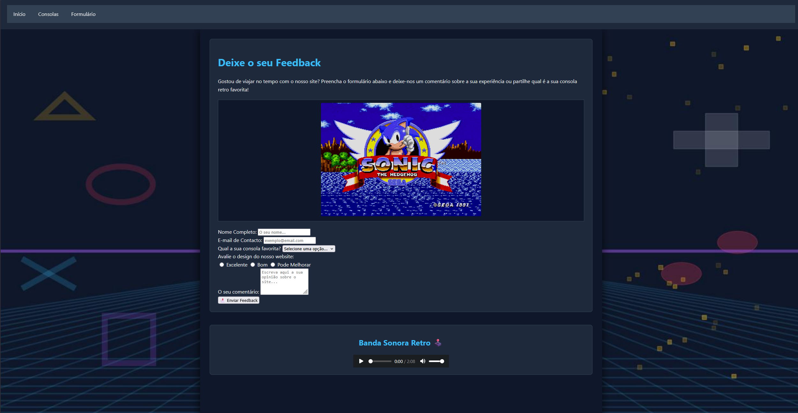

## 🚀 Como testar o projeto

Temos duas formas de aceder ao projeto/website, que seriam as seguintes:

### 🌐Online
O projeto está hosted no Netlify, não é necessário descarregar nenhum código nem fazer download de nenhuma tool. Apenas clica no link abaixo para aceder ao website. https://inf25tig02.netlify.app

### 💻Ver no computador
Caso queiras rever o código, ou aceder diretamente a partir da tua máquina.

. Clica no botão verde **"Code"** aqui no topo da página e escolhe **"Download ZIP"**.

. Extrai a pasta para o teu PC.

. Para veres o site, basta dares dois cliques no ficheiro `index.html` ou qualquer outro ficheiro html. Isto vai automaticamente abrir a página no teu default browser.

. Caso queiras analisar o código, podes sempre fazer download do VS Code neste website https://code.visualstudio.com/. Apenas tens de abrir o VS Code ir a File e escolher Open Folder e escolher a root folder do projeto

### ✅ Validação de Código (W3C)

Para garantir que o projeto cumpre as melhores práticas da web e os rigorosos padrões semânticos, todos os ficheiros foram testados nas ferramentas oficiais da W3C.

#### 📄 Validação HTML5 (W3C Markup Validation Service)
As cinco páginas que compõem o ecossistema do website foram validadas individualmente com sucesso:

* `index.html` (Página Principal e Catálogo XML)
* `ps1.html` (Página PlayStation 1)
* `ps2.html` (Página PlayStation 2)
* `gbc.html` (Página Game Boy Color)
* `formulario.html` (Página de Feedback e Contacto)

**Comprovativos (HTML):**
 
Index
 
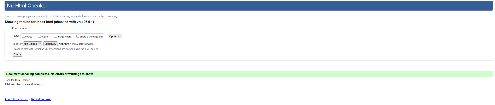

PS1
 
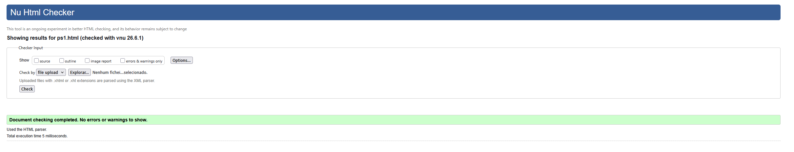

PS2
 
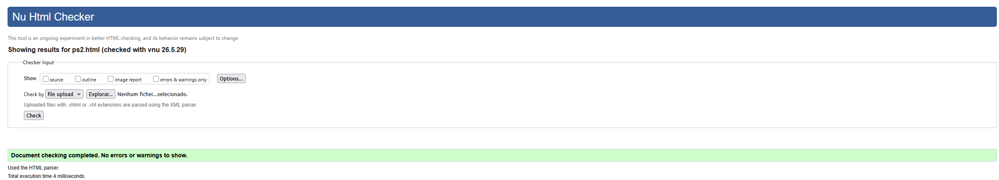

GBC
 
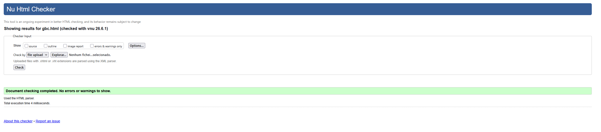

Formulário
 
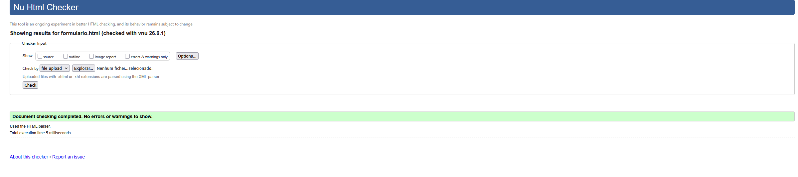

#### 🎨 Validação CSS3 (W3C CSS Validator)
O ficheiro styles, que é responsavel pelos estilos aplicados na página web também passou sem erros.

* `styles.css`

**Comprovativo (CSS):**
 
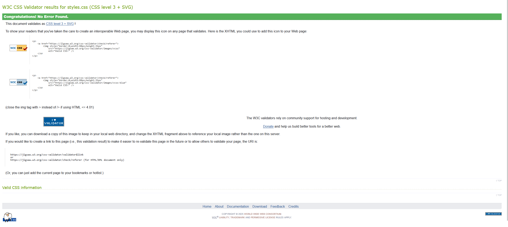

